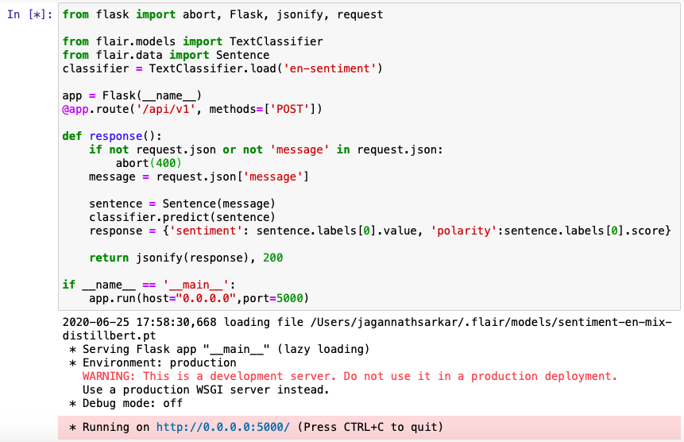

# Build and publish in AWS ECS (Elastic Container Service) a microservice on sentiment analysis using python and [flair](https://pypi.org/project/flair/) NLP library

There are several models on NLP (natural language processing) based sentiment analysis, which can determine if a particular block of text has a positive, negative, or neutral sentiment. There are off-the-shelf rule-based models like [TextBlob](https://pypi.org/project/textblob/) or embedding-based like [Flair](https://pypi.org/project/flair/), which is a PyTorch-based framework for state-of-the-art NLP library that supports sequence tagging, embeddings, and classification.

## Comparing [Textblob](https://pypi.org/project/textblob/) and [Flair](https://pypi.org/project/flair/) models

[Textblob](https://pypi.org/project/textblob/) provides a simple rule-based API for sentiment analysis that returns a polarity score within the range of (1.0 to -1.0), and a subjectivity score within the range of (0.0 to 1.0). Positive sentiment has a positive polarity number, and negative sentiment has a negative polarity number. A score 0 indicates the text is very objective and returns a higher score when the text is fairly subjective.

To install using pip (Python Package Installer)
  
    pip3 install textblob

    from textblob import TextBlob
    blob = TextBlob("The book was engaging, enjoyed reading, definitely recommending")
    for sentence in blob.sentences:
        print(sentence.sentiment)
  
[Flair](https://pypi.org/project/flair/) provides the API that utilizes a pre-trained model to detect positive or negative comments and provides the response in terms of positive or negative with a prediction confidence score in the range of (0.0 - 1.0)

To install using pip (Python Package Installer)

    pip3 install flair
    
    from flair.models import TextClassifier
    from flair.data import Sentence
    classifier = TextClassifier.load('en-sentiment')
    sentence = Sentence("The book was engaging, enjoyed reading, definitely recommending")
    classifier.predict(sentence)
    print('Sentence Score : ', sentence.labels)

 

## Using the [flair](https://pypi.org/project/flair/) model and build an API with [Flask](https://pypi.org/project/Flask/)

[Flask](https://pypi.org/project/Flask/) is a micro-web application framework with a simple wrapper around Werkzeug and Jinja.

To install using pip (Python Package Installer)

    pip install Flask
    
    from flask import abort, Flask, jsonify, request
    from flair.models import TextClassifier
    from flair.data import Sentence
    classifier = TextClassifier.load('en-sentiment')

    app = Flask(__name__)
    @app.route('/api/v1', methods=['POST'])

    def response():
        if not request.json or not 'message' in request.json:
            abort(400)
        message = request.json['message']
        sentence = Sentence(message)
        classifier.predict(sentence)
        response = {'sentiment': sentence.labels[0].value, 'polarity':sentence.labels[0].score}
        return jsonify(response), 200

    if __name__ == '__main__':
        app.run(host="0.0.0.0",port=5000)    
    

HTTP POST request to the API running on localhost:5000

    curl --request POST --url http://localhost:5000/api/v1 --header 'content-type: application/json' --data '{"message":"The book was engaging, enjoyed reading, definitely recommending"}' 
    

Create a [app.py](./app.py)

## Create an [AWS EC2](https://console.aws.amazon.com/ec2/) instance

Launch an EC2 Instance using Ansible Playbook [yml](./aws-ec.yml). 

Requirements - Ansible, Python , Boto and an AWS Account to Launch an EC2 instance.

> **Note:** [Ansible](https://docs.ansible.com) automation engine will be used for [AWS EC2](https://aws.amazon.com/console/) provisioning and application deployment. Install Ansible for Mac (using Homebrew or Python pip Package Manager).

    brew install ansible      
or

    pip3 install ansible  

>  Install Boto with pip, ([Boto](https://boto3.amazonaws.com/v1/documentation/api/latest/index.html) is the Amazon Web Services (AWS) SDK for Python)

    pip3 install boto

>  Create a .boto file with the AWS account credentials in credentials.csv and save with permission 400 -> chmod 400 .boto so that, (U)ser / owner can read, can't write and can't execute

    [Credentials]
    aws_access_key_id = [Access key ID]
    aws_secret_access_key = [Secret access key]

> The deployment playbook - [aws-ec.yml](./aws-ec.yml)

|    key          |    description                |
|---------------- |-------------------------------|
|`'gather_facts'` | gathers facts about remote hosts (boolean)|
|`'key_name'`     | EC2 Console -> NETWORK & SECURITY -> Key pairs|
|`'instance_type'`| t2.micro or t2.small|
|`'image'`        | define an Amazon Machine Image (AMI)|
|`'group'`        | define a security Group, EC2 Console -> NETWORK & SECURITY -> Security Groups|
|`'count'`        | number of instances to launch|
|`'vpc_subnet_id'`| From VPC - Select a Subnet ID in the Availability Zone|
|`'wait'`         | playbook to wait for the instance to be launched and assign a public IP|

Run the playbook - 

    ansible-playbook aws-ec.yml
    

## Login to the EC2 instance and move the app.py over ssh

To move the file to EC2 -
          
    scp -i "EC2KeyPair.pem" ./app.py ec2-user@ec2-18-218-185-203.us-east-2.compute.amazonaws.com:/home/ec2-user/app.py

Connect to EC2 instance -

    ssh -i "EC2KeyPair.pem" ec2-user@ec2-18-218-185-203.us-east-2.compute.amazonaws.com
         

## Configure docker in EC2

Update the installed packages and package cache and then install [docker] (https://docs.docker.com/get-docker/)	engine in EC2 instance

    sudo yum update -y
    sudo yum install docker
    sudo service docker start  
    sudo usermod -a -G docker ec2-user
    
Here adding the ec2-user to the docker group to execute docker commands without using sudo, then close the current terminal and log back in a new SSH session.

## Create a docker image in EC2

Create a [requirements.txt](/requirements.txt) for Flask and flair (two python modules used in app.py)

    flair==0.5
    Flask==1.1.2

Create a [Dockerfile](.Dockerfile) with the [Python](https://hub.docker.com/_/python) base image from the [docker hub](https://hub.docker.com) as a starting point, and the RUN command will reference from requirements.txt.

    FROM python:3
    COPY . /app
    WORKDIR /app
    RUN pip3 --no-cache-dir install -r requirements.txt
    EXPOSE 5000
    CMD python3 ./app.py
    
Build the docker image `'webapi'` from the Dockerfile and requirements.txt

    docker build -t webapi .
    
Check the docker image

    docker image ls
    

## Run the docker container in EC2

Run the image `'webapi'` as a container `'webapi'` (port 5000)

    docker run --name webapi -p 5000:5000 webapi
    

Now, the container is created and running.

Let’s test using curl from the local system – (using EC2 IP `'18.218.185.203'`, instead of localhost now).

Write a python [consumer.py](./consumer.py) to test from the `'local'` system.

    import requests
    url = 'http://18.218.185.203:5000/api/v1'
    msg = {'message':'The book was engaging, enjoyed reading, definitely recommending'}
    response = requests.post(url, json = msg)
    print(response.text)

So, the micro-service API is containerized and deployed in AWS EC2 and running, also tested from a [consumer](./consumer.py) python app.

## Push the image to AWS Elastic Container Registry

Set up `'aws configure'` in EC2 to run AWS CLI (from the `'credentials.csv'`)

    aws configure
    
    AWS Access Key ID : 
    AWS Secret Access Key : 
    Default region name : us-east-2
    Default output format : json

Create an AWS ECR repository `'webapi-repository'` to store the docker image

    aws ecr create-repository --repository-name webapi-repository --region us-east-2
    
    

Run the AWS ECR get-login-password, specify the registry URI to authenticate to, and retrieve an authentication token to authenticate the docker client to the registry.

    aws ecr get-login-password --region us-east-2 | docker login --username AWS --password-stdin 212487149830.dkr.ecr.us-east-2.amazonaws.com
    

Tag the webapi image with the `'repositoryUri`' value from the previous step
				
    docker tag webapi 212487149830.dkr.ecr.us-east-2.amazonaws.com/webapi-repository

Push the image to AWS ECR with the `'repositoryUri`' value from the earlier step

    docker push 212487149830.dkr.ecr.us-east-2.amazonaws.com/webapi-repository
	

Container image is up in [AWS ECR](https://console.aws.amazon.com/ecs/)

## Publish the container in AWS ECR cluster from AWS ECS console:

